#### Showcasing my Android Development projects and skills

---

## Projects

### [OGOW Health](https://play.google.com/store/apps/details?id=com.ogowemr.health) | (Xeven Solutions (Pvt) Ltd.)
- **Role:** Android Developer

- **Technologies:**
  
  
  
  

- **Features:**
  - Access and manage patient records, even in remote areas.
  - Enhance healthcare policy adherence and understanding through mobile solutions.
  - Build patient trust through community-centric healthcare methods.
  - Equip healthcare providers with the tools they need for better service delivery in low-resource settings.

- **Challenges & Solutions:**
  - Accessibility in remote, low-resource areas with limited internet connectivity.
  - Developed offline capabilities to store and sync patient data once internet access is available.
  - Training healthcare providers on new mobile health technologies.

#### Screenshots:

  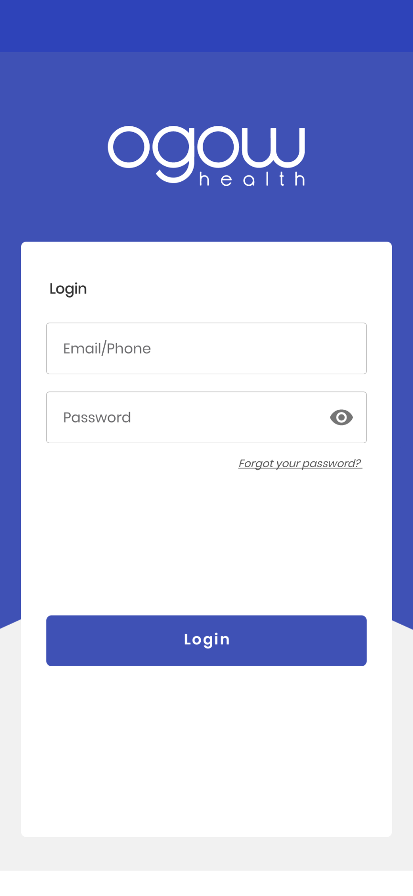
  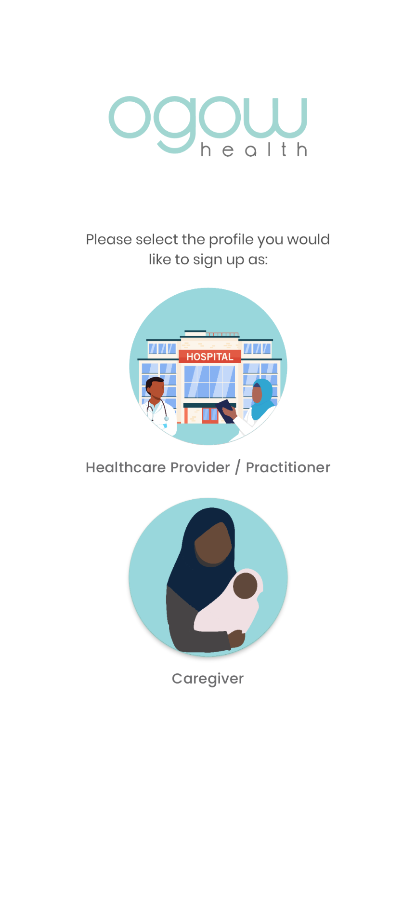
  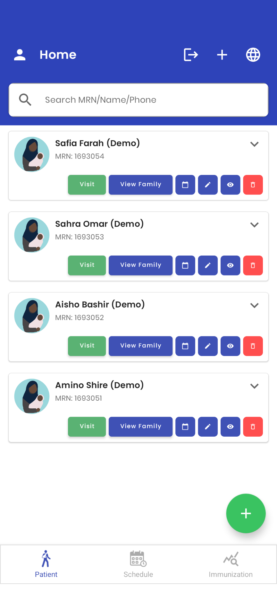
  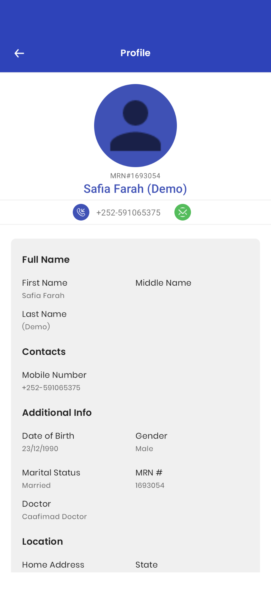

---

### [Contestant Center](https://play.google.com/store/apps/details?id=com.oboIdeas.contestant) | (Xeven Solutions (Pvt) Ltd.)
- **Role:** Android Developer

- **Technologies:**
  
  
  
  
  

- **Features:**
  - Organize performance notes and videos for contestants, coaches, and stock contractors.
  - Competition coaching and livestock advertising.
  - Manage rodeo events with ease.

- **Challenges & Solutions:**
  - Implemented efficient video storage and retrieval system using AWS S3 SDK.
  - Enhanced user experience with intuitive UI and smooth navigation.

#### Screenshots:

  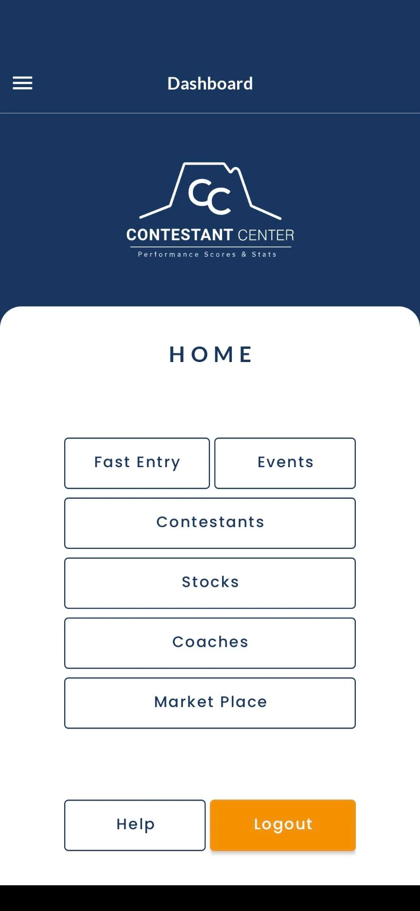
  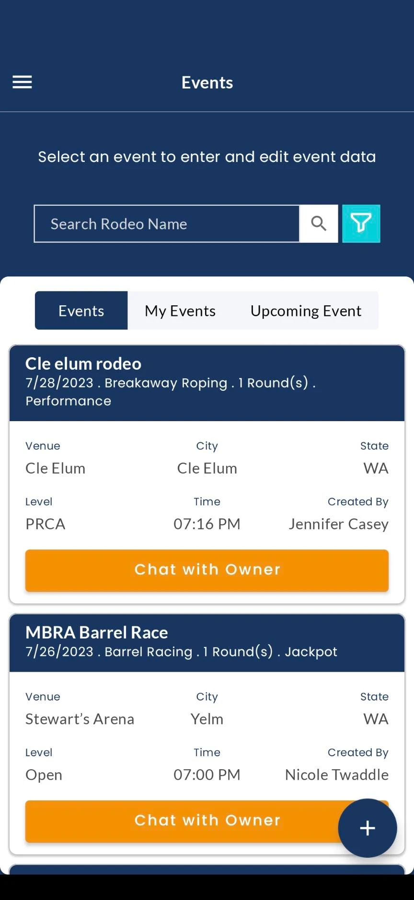
  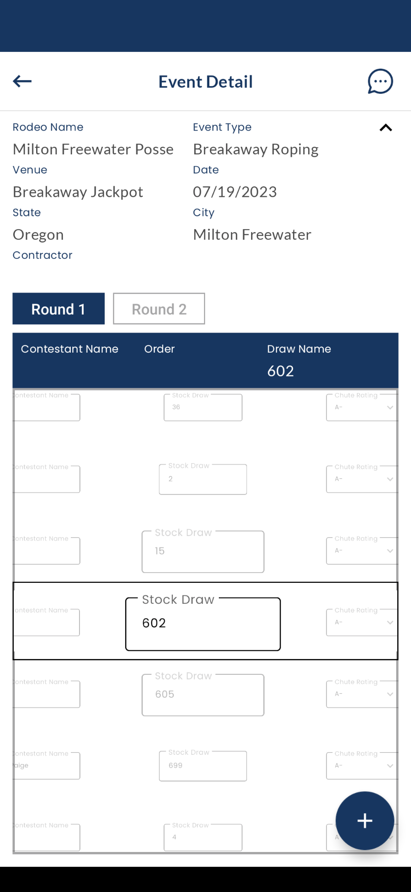

  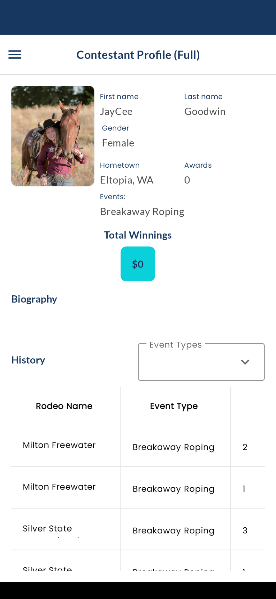
  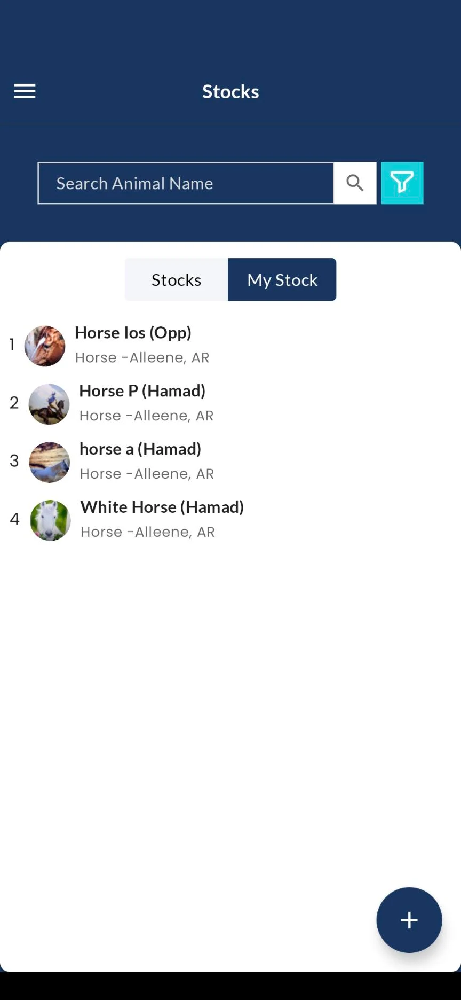
  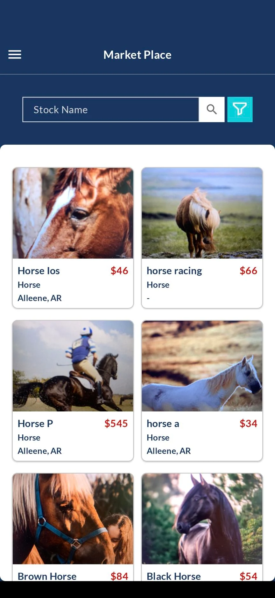

---

### [IMTrade](https://play.google.com/store/apps/details?id=com.microlinks.IMTrade) | (Softech Systems (Pvt) Ltd.)
- **Role:** Android Developer

- **Technologies:**
  
  
  
  

- **Features:**
  - Live Market Watch feature.
  - Investing and trading on companies listed on Pakistan Stock Exchange.
  - Live stock prices monitoring.
  - Portfolio management.

- **Challenges & Solutions:**
  - Ensuring real-time data updates for live stock prices.
  - Implementing secure authentication and transaction handling.

#### Screenshots:

  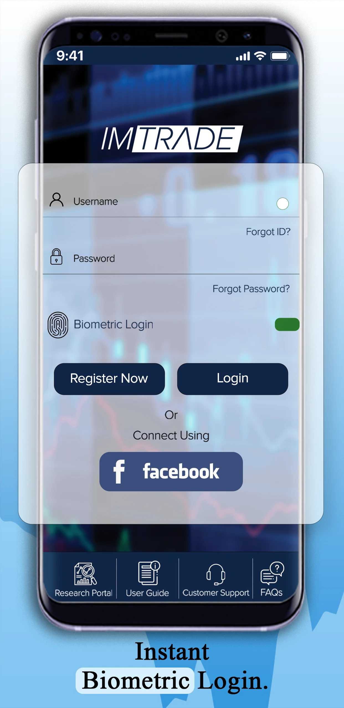
  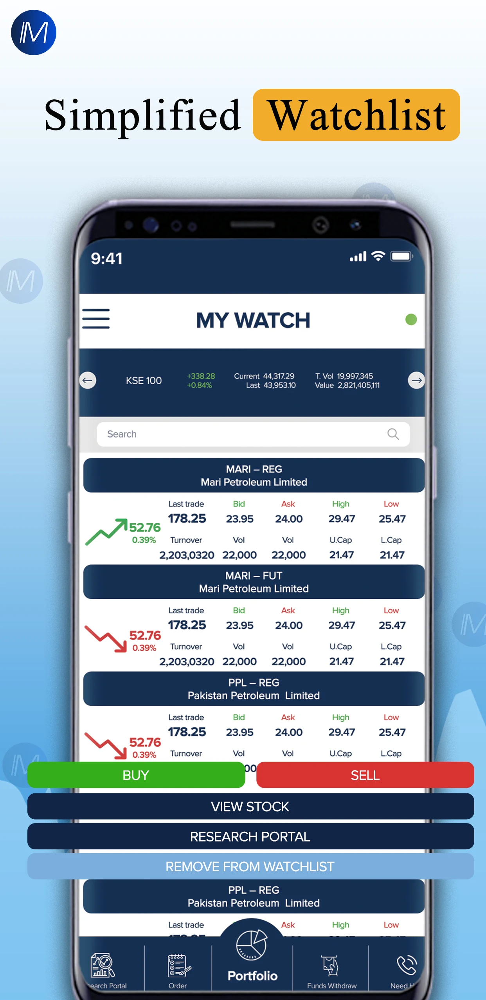
  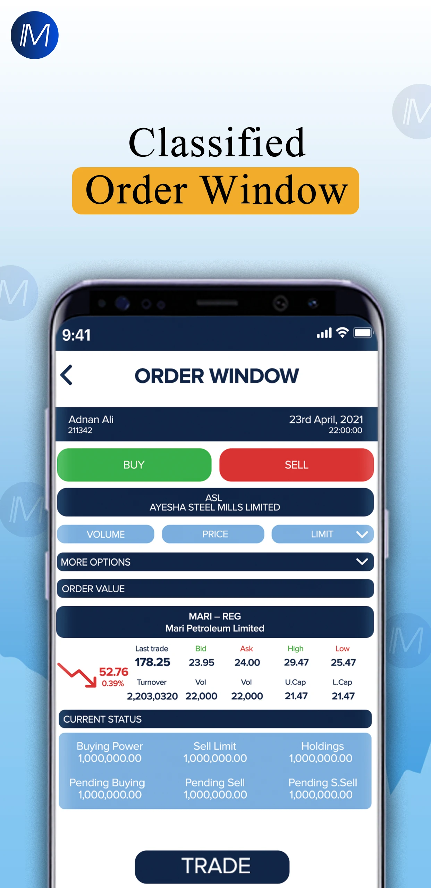

  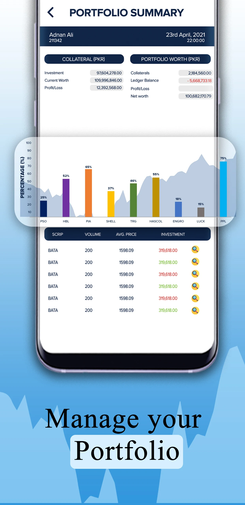
  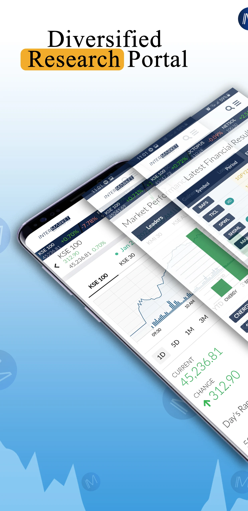
  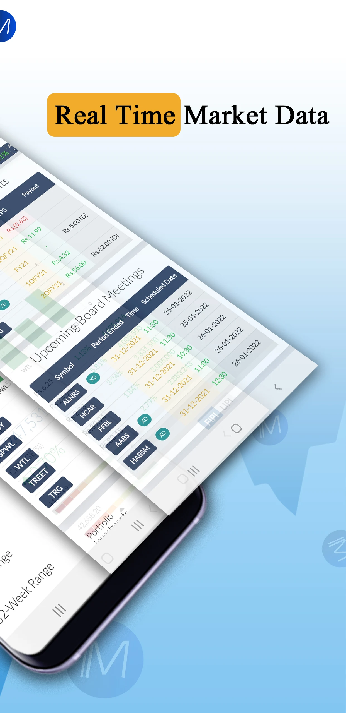

---

### [UzTrip](https://play.google.com/store/apps/details?id=com.uztrip.application) | (Avicenna Enterprise Solutions)
- **Role:** Android Developer

- **Technologies:**
  
  
  
  

- **Features:**
  - Social media platform similar to Facebook.
  - Posting images and videos.
  - Like, share, and comment on posts.
  - Multi-language support: English, Russian, Uzbek.

- **Challenges & Solutions:**
  - Implementing multi-language support without impacting performance.
  - Ensuring seamless media upload and sharing functionality.

#### Screenshots:

  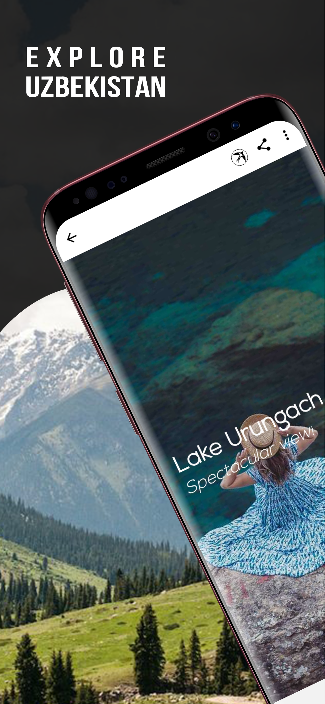
  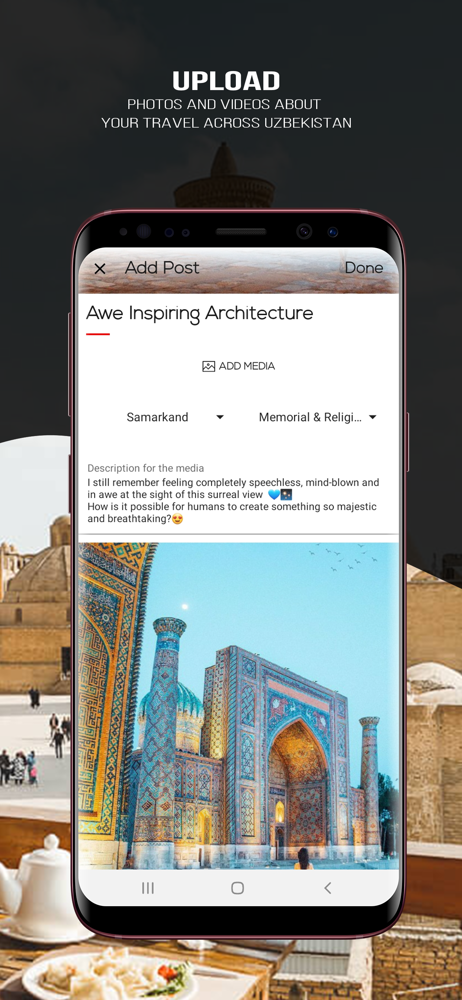
  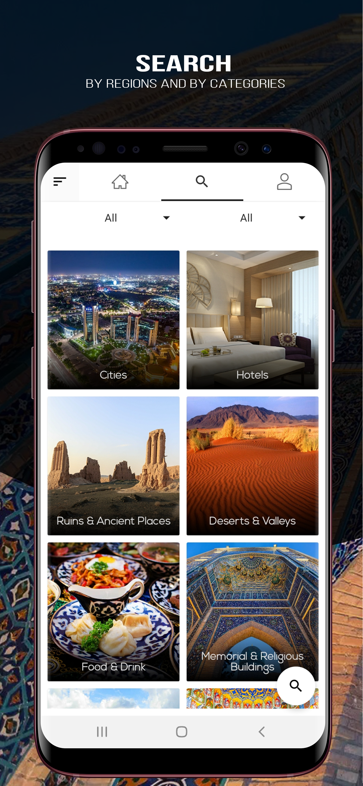

  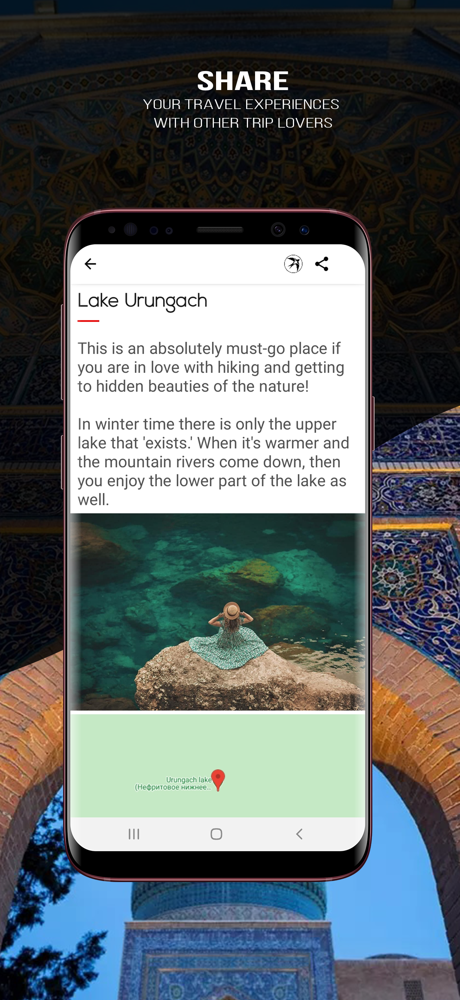
  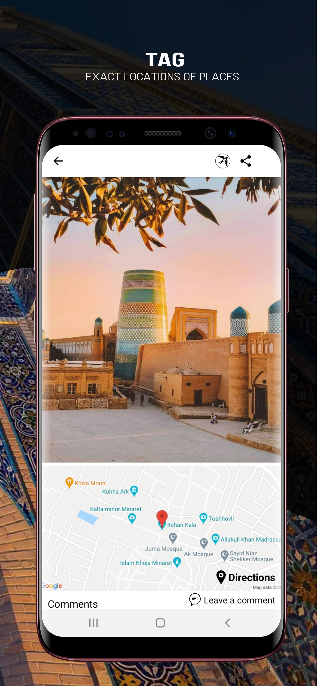
  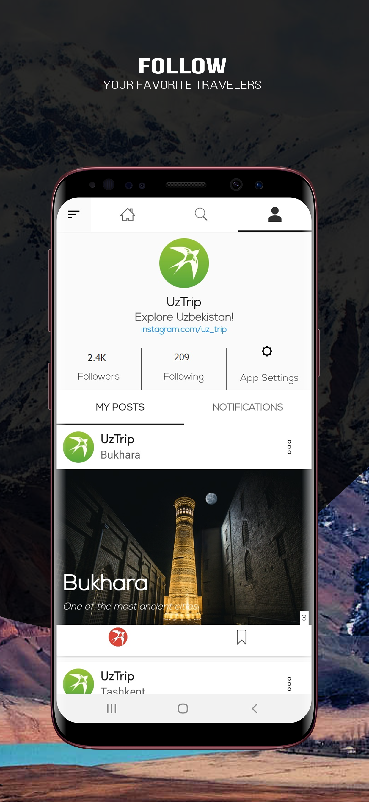

